# Portal Selection

**CS 5678: 3D User Interfaces - Spring 2024 - [XR Collaboratory](https://xrcollaboratory.tech.cornell.edu), Cornell Tech**

**Students: Gilberto E. Ruiz, Michael Hanlon**

[Video](https://youtu.be/n78cVYveQ5M) | 
[Report](https://drive.google.com/file/d/1WvzeLLBhqOiFe44zZu_B5tMuoPKVGFvi/view?usp=sharing) |
[APK](https://drive.google.com/file/d/13Mx-_yoJ5lhdS_RioCGetk0gQpsmDXvG/view?usp=drive_link)

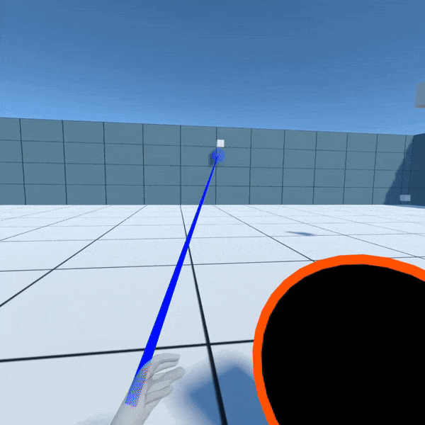

## Overview
Portal Selection is a VR interaction technique inspired by games
like ”Portal” and ”Portal 2,” enabling users to interact with objects
through two portals activated by hand gestures. Users can shoot
portals with their left hand, rotate the portal with their right hand and manipulate/grab objects through the portal with their right hand. By making use of ray casting with their left
hand, users can place a blue portal, which will automatically connect to the orange portal near their side. Objects can be brought through the portals by simply reaching through the portal and grabbing with their right hand.

### Technique Intructions
To use the Portal Selection interaction technique, start by positioning your hands in view of the VR headset's sensors after the scene has loaded. Aim at your desired location using your left hand to direct the line renderer, which indicates potential portal placements. To activate and place a portal, simply perform a pinch gesture with your left hand. Before a portal is placed, you can also adjust its orientation by using your right hand. Pinch with your right hand to "grab" the portal; this will allow you to rotate it to the desired angle, and will also lock the distance of the portal so that you can place it midair. Pinch your left hand to activate the portal at the desired angle and position. The color of the line renderer will change to blue for valid placement areas and red for invalid ones, with a portal preview appearing at potential locations to assist in accurate placement.

## Components

### Portals
This component implements the logic for the portals present in the Portal Selection interaction technique as presented in our paper. This script is responsible for check the objects currently colliding with either of the portals, and warping them to the other portal if they cross through a portal.

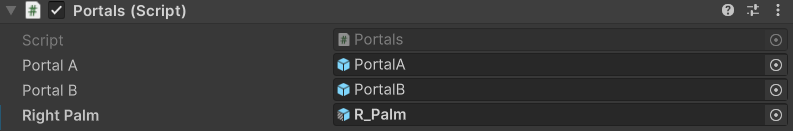

| **Property**         | **Description**          |
|----------------------|--------------------------|
| **Portal A** | The first of the two portal GameObjects, appearing with an orange outline and anchored near the user. |
| **Portal B** | The first of the two portal GameObjects, appearing with a blue outline and placeable by the user. |
| **Right Palm** | The part of the right hand used to detect collisions and as a midpoint of the hand for teleportation. |

### PortalsFeedback
This component is responsible for providing feedback for the portals of the Portal Selection interaction technique. This includes rendering the surface of each portal by positioning a camera behind the view of the opposite portal.

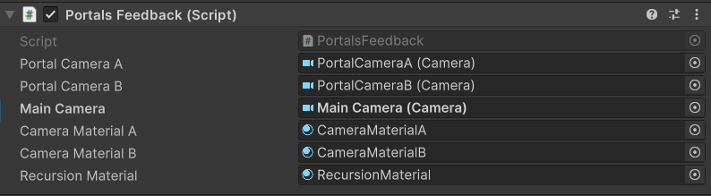

| **Property**         | **Description**          |
|----------------------|--------------------------|
| **Portal Camera A** | The camera used to render the perspective of portal A, oriented based on the position of the main camera. |
| **Portal Camera B** | The camera used to render the perspective of portal B, oriented based on the position of the main camera. |
| **Main Camera** | The main camera of the scene. |
| **Camera Material A** | The material to which portal camera A is rendered. |
| **Camera Material B** | The material to which portal camera B is rendered. |
| **Recursion Material** | The material used when a portal is in the field of view of another portal. |

### PortalSelection
PortalSelection manages the selection and teleportation of the pose marker based on user input and feedback from the PortalSelectionFeedback class. When the user performs a pinch gesture, the pose marker is teleported to the location where the line renderer (raycast) from PortalSelectionFeedback hit a valid surface.

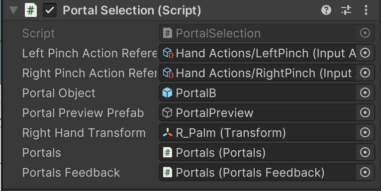

| **Property**         | **Description**          |
|----------------------|--------------------------|
| **Left Pinch Action Reference** | Reference to the left pinch gesture input action. |
| **Right Pinch Action Reference** | Reference to the right pinch gesture input action.|
| **Portal Object** | The GameObject that represents the marker for portal placement.|
| **Portal Preview Prefab** | Prefab for displaying the portal preview before placement.|
| **Right Hand Transform** | Transform of the user's right hand to track its rotation.|
| **Portals** | Reference to the Portals system managing multiple portals.|
| **Portals Feedback** | Feedback system for portal interactions.|

### PortalSelectionFeedback
This PortalSelectionFeedback is responsible for providing visual feedback for the portal placement process. It creates a raycast from a given origin and changes the line renderer's appearance based on whether a suitable surface for portal placement has been hit.

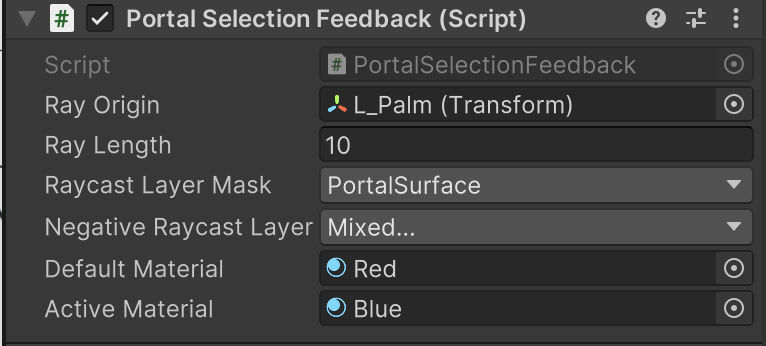

| **Property**         | **Description**          |
|----------------------|--------------------------|
| **Ray Origin** | The origin point from which the raycast is emitted. |
| **Ray Length** | The default maximum length of the ray when no surface is hit.|
| **Raycast Layer Mask** | Layer mask to filter the raycast for valid portal surfaces. |
| **Negative Raycast Layer Mask** | Layer mask to filter the raycast for invalid portal surfaces. |
| **Default Material** | Material that represents an invalid surface |
| **Active Material** | Material that represents a valid surface |

### PortalCollisions
This component handles collisions for the individual portals. Collided objects are added to the portalObjects property of the portal, which is then accessed by the Portals logic component.

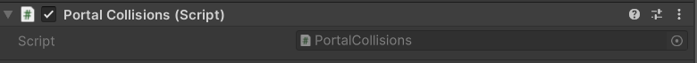

## Installation instructions
To install this package, follow these steps:
1. In the Unity Editor, click on **Window > Package Manager**
2. Click the + button and choose **Add package from git URL** option
3. Paste the URL to the package repository: https://github.com/cs5678-2024sp/p-project-g-02.git or git@github.com:cs5678-2024sp/p-project-g-02.git in the prompt and click on **Add** (make sure your URL ends with ".git")
4. If the repository is private, you will be asked to authenticate via your GitHub account. If you haven't been granted access to the repository you will not be able to install the package.
5. The package should be installed into your project
6. You can download the package samples from under the Samples tab in the Package Manager

Note: Even though the package documentation is public, several XRC packages are private and accessible only to XRC staff and students.

## Requirements
This package was developed and tested using the following Unity Editor version:

**2022.3.7f1 LTS**

Dependencies:
- [XRC Core](https://xrcollaboratory.github.io/edu.cornell.xrc.core)
- **Input System**
- **XR Interaction Toolkit**

Note: 
- The package itself does not have any dependencies on hand tracking packages. The provided sample showcases the package in use with both XR Hands and the Unity OpenXR: Meta package, and has dependencies on these packages. 

## Limitations	
### Important: If you run the code with your hands in frame of the vr headset camera, it will crash. Make sure to run the code and put your hands behind your back before it loads. 

**Additionally,** in order for the portal shader to render correctly, the Unity project settings must have OpenXR configured with Render Mode set to Multi-pass in the following places:

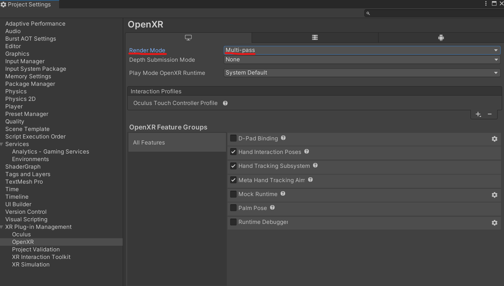

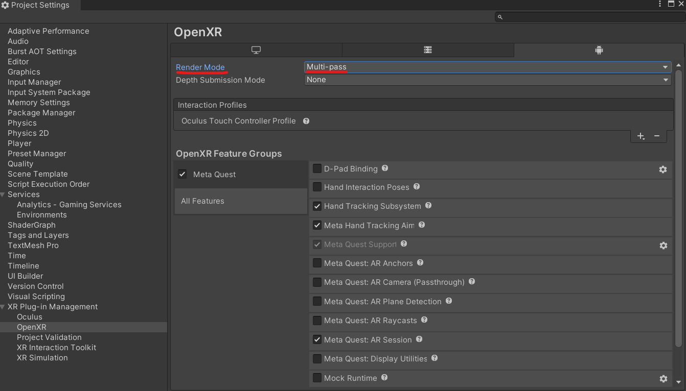

## Workflow

See below the screenshots for a scene hierarchy and the inspector for a game object containing all package components. 

This first screenshot has the portal components.
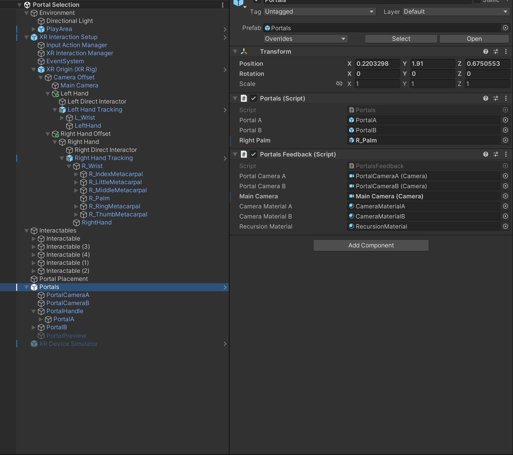

This second screenshot has the portal selection components.
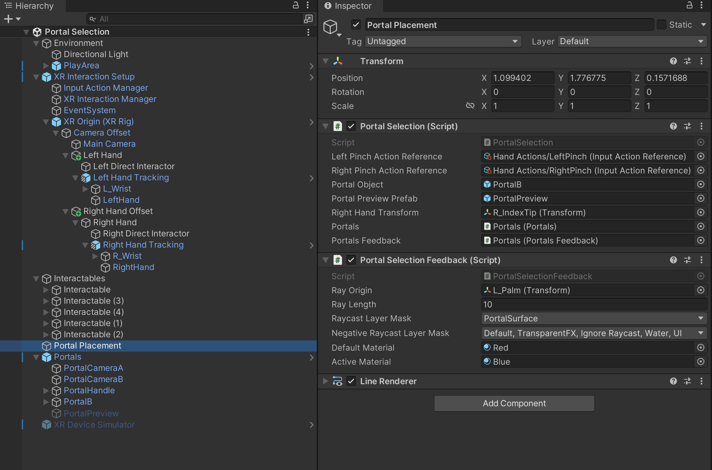

This third screenshot shows that a collider must be placed on the right palm hand tracker. 
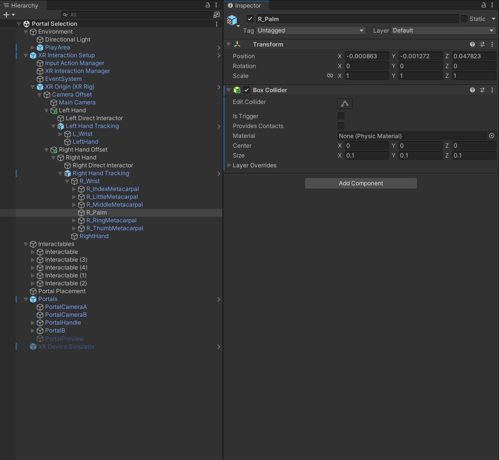

## Samples
### Portal Selection
This includes a sample showcasing the Portal Selection implementation in a Unity scene with hand tracking enabled.
The sample has the following dependencies:

- **XR Hands 1.4.0**
- **Unity OpenXR Meta 1.0.1**

**Important:** Before using the sample scene, User Layer 3 must be set to PortalSurfaces and the layer mask on the Portal Selection Feedback component must be configured as follows:

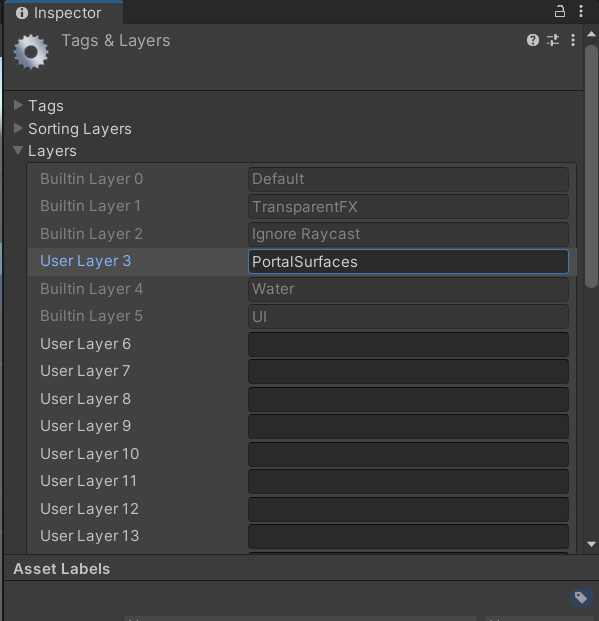

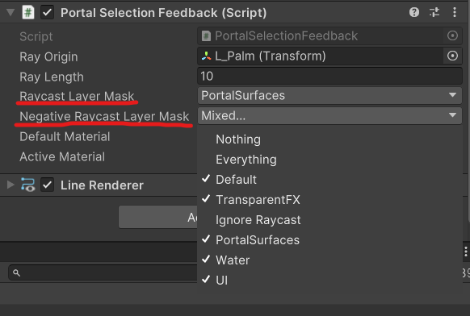

