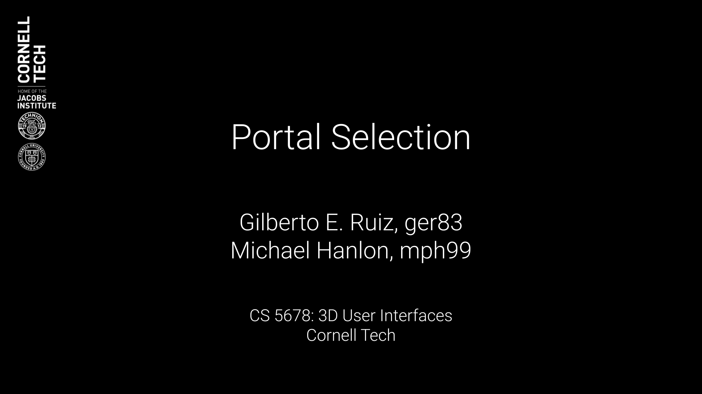
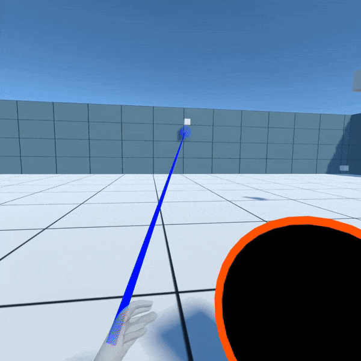
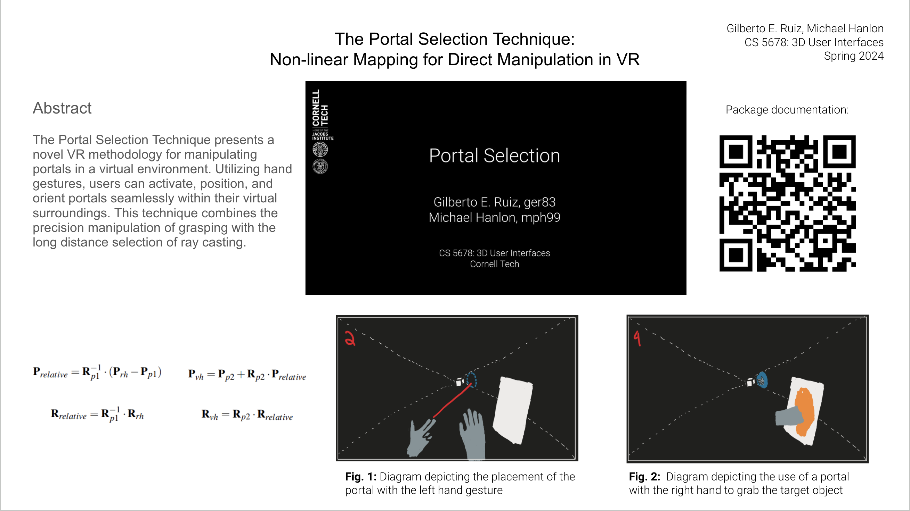

# Portal Selection

**Portal Selection** is a virtual reality interaction technique inspired by the video game *Portal*. This project was developed as the final project for **CS 5678: 3D User Interfaces** at **Cornell Tech** during Spring 2024. The project combines gesture-based portal placement and object manipulation to enhance user interaction within virtual environments. By utilizing **Unity’s XR Interaction Toolkit**, the system blends ray casting and grasping techniques for intuitive and precise interaction.

---

## Project Description

The **Portal Selection** technique offers an innovative way to interact with virtual objects across distances using portals. Users activate, position, and orient portals with their hands, using gestures to create seamless and immersive interactions. The system features visual feedback through ray casting and color-coded line renderers, enabling users to place portals on valid surfaces and even midair for extended functionality.

### Key Features
- **Gesture-Based Interaction**: Intuitive hand gestures for portal placement and adjustment.
- **Hybrid Interaction Model**: Combines ray casting for long-distance selection and grasping for precision manipulation.
- **Real-Time Visual Feedback**: Displays valid portal placement surfaces and highlights interactable objects dynamically.
- **Shader Integration**: Custom shaders for realistic portal rendering and object transitions.

---

## System Architecture

### Components
1. **Hardware**:
   - Oculus Quest 2 or compatible VR headset.
   - Hand-tracking sensors for gesture input.
2. **Software**:
   - Unity 2021.3.0 or later.
   - XR Interaction Toolkit for hand gesture recognition and ray casting.
   - Custom C# scripts for portal mechanics and interactions.
  
### Development Workflow
The **Portal Selection VR Interface** required a multi-faceted development approach, combining Unity's robust VR capabilities with advanced scripting. The overall virtual reality interface and environment were developed in **Unity's Developer Mode**, which allowed for precise customization and integration of 3D models, gestures, and interactive elements.

To achieve the sophisticated logic and interactivity behind the portal manipulation, the **C# scripts** were written and refined using **JetBrains Rider**, an IDE optimized for .NET development. This workflow ensured a streamlined coding experience with advanced debugging tools, seamless version control, and deep integration with Unity. By leveraging Unity for design and Rider for script development, the team created an intuitive and responsive system for portal placement and object manipulation.

### Portal Mechanics
- **Portal Placement**: Uses ray casting to dynamically adjust the length and orientation of the ray based on hand position.
- **Portal Rendering**: Employs custom shaders to render portal surfaces and enable seamless object transition between portals.

---

## Getting Started

### Prerequisites
- Unity Editor 2021.3.0 or later installed.
- XR Interaction Toolkit configured in Unity.
- VR headset with hand tracking enabled.

### Steps to Use
1. **Set Up the Environment**:
   - Import the Unity package provided in this repository.
   - Open the `PortalSelection.unity` scene in Unity.
2. **Run the Scene**:
   - Connect your VR headset to the computer.
   - Enter Play mode in Unity and interact with the virtual environment using hand gestures.
3. **Portal Placement**:
   - Use your left hand to aim and pinch to place a blue portal.
   - Adjust the orange portal’s position and orientation with your right hand.

---

## Results

### Demo
Watch the demo of Portal Selection in action:
- [**Full Demo Video**](https://drive.google.com/file/d/1jPBUdAvpSOLFfiyJ01FsOMsfMXCb7ou0/view?usp=sharing)

### Documentation
For a detailed explanation of the project, visit the project’s documentation website:
- [**Portal Selection Documentation**](https://cs5678-2024sp.github.io/p-project-g-02/)

---

## Reflections and Future Enhancements

### Achievements
- Successfully implemented a hybrid portal interaction model combining ray casting and grasping.
- Designed and developed an intuitive gesture-based portal placement system.
- Enhanced visual fidelity with custom shaders for immersive gameplay.

### Future Enhancements
- **Controller-Based Implementation**: Transition from hand-tracking to controllers for improved input reliability.
- **Shader Optimization**: Improve portal surface rendering for higher accuracy and reduced distortion.

---

## Acknowledgments

This project was developed in collaboration with:
- **Michael Hanlon**
